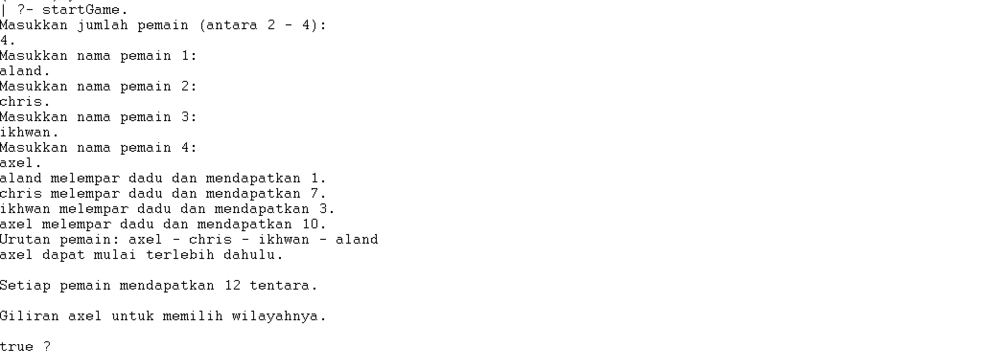
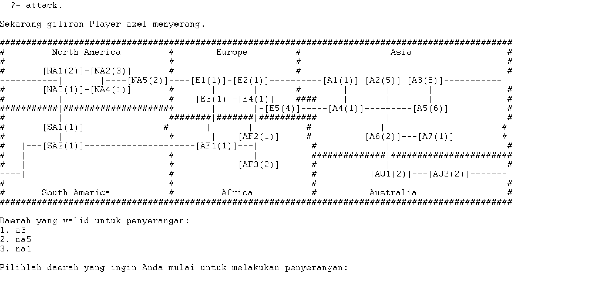

# tugas-besar-if2121-logika-komputasional-2023-kuda-hitam
## Global Conquest: Battle for Supremacy
## Table of Contents
  - [Table of Contents](#table-of-contents)
  - [General Information](#general-information)
  - [Screenshots](#screenshots)
  - [Contributor](#contributor)
  - [Technologies Used](#technologies-used)
  - [Features](#features)
  - [How to Use](#how-to-use)
    - [Dependencies](#dependencies)
    - [Installation](#installation)
    - [Program Execution](#program-execution)

## General Information
Global Conquest adalah sebuah game strategi yang dibuat menggunakan bahasa pemrograman deklaratif Prolog (GNU Prolog). Game ini memberikan pemain kesempatan untuk mendominasi dunia melalui berbagai tantangan dan strategi. Tugas besar ini bertujuan untuk mengintegrasikan berbagai konsep Logika Komputasional IF2121 yang telah dipelajari, seperti rekurens, list, cut, fail, dan loop. Selain itu, tugas besar ini juga bertujuan untuk memperdalam pemahaman tentang pemrograman deklaratif menggunakan Prolog.
## Screenshots
### Tampilan startGame.

### Tampilan displayMap.


## Contributor
### Kuda Hitam
| Nama | NIM |
|---|---|
| Aland Mulia Pratama | 13522124 |
| Christian Justin Hendrawan | 13522135 |
| Ikhwan Al Hakim | 13522147 |
| Axel Santadi Warih | 13522155 |

## Technologies Used
- Programming Logic Language
- GNU Prolog console

## Features
Berikut adalah fitur-fitur atau perintah yang terdapat pada permainan Global Conquest dengan bahasa Pemrograman GNU Prolog beserta deskripsi singkat dari fitur tersebut.
| No. | Fitur | Deskripsi Singkat|
|---|---|---|
| 1 | displayMap. | Menampilkan peta dunia yang berisi 24 wilayah dengan 6 benua|
| 2 | startGame. | Digunakan diawal sebelum permainan dimulai untuk memulai game yang baru|
| 3 | takeLocation(LocationID). | Pemain mengambil 1 lokasi untuk dijadikan wilayah dibawah kekuasaan-nya. |
| 4 | placeTroops(LocationID, JumlahTroops). | Menaruh seluruh sisa pasukannya ke dalam lokasi pilihan mereka sebanyak yang mereka inginkan. |
| 5 | placeAutomatic. | Menaruh pasukan secara otomatis. |
| 6 | endTurn. | Command ini digunakan bila player yang saat ini dalam giliran sudah selesai melakukan putarannya, dan ingin melanjutkan ke player Selanjutnya. |
| 7 | draft(LocationID, Troops). | Command ini dipakai apabila player ingin menaruh tentara tambahannya ke dalam salah satu lokasi yang dimiliki oleh player. |
| 8 | move(LocationID1, LocationID2, Troops). | player dapat memindahkan tentara di wilayahnya. |
| 9 | attack. | Command ini dapat dipakai player apabila player merasa percaya diri dan ingin menyerang suatu Wilayah. |
| 10 | risk. | Command ini dapat dipakai player apabila player ingin mengambil sebuah ‘risk card’. Pada saat player mengambil ‘risk card’ |
| 11 | checkLocationDetail(LocationID). | Command ini dapat dipakai player apabila player ingin mengakses detail informasi dari sebuah lokasi, baik yang dimilikinya, maupun yang dimiliki player lain. |
| 12 | checkPlayerDetail(PlayerID). | dapat dipakai player untuk mengakses informasi detail dari player lain, dimana nanti akan ditunjukan nama pemain, benua yang dikuasai, total wilayah, total tentara aktif, dan total tentara tambahan dari player tersebut. |
| 13 | checkPlayerTerritories(PlayerID). | Command ini dapat dipakai player untuk mengakses informasi mengenai lokasi lokasi yang dikuasai oleh player ‘PlayerID’ dari semua benua, dan menampilkan kode lokasi, nama lokasi dan juga jumlah tentara yang ada pada lokasi tersebut. |
| 14 | checkIncomingTroops(PlayerID). | Command ini dapat dipakai player untuk mengakses informasi mengenai tentara tambahan yang akan datang ke player ‘PlayerID’ pada saat player tersebut mengakses fungsi endTurn. |
| 15 | win mechanism | Player menang apabila dia merupakan player terakhir yang tersisa atau the last man standing. |
| 16 | lose mechanism | Player kalah apabila dia merupakan player yang sudah tidak memiliki wilayah yang dikuasai. |

## Structure
```bash
.
├── doc
│   ├── Progress1_G32.pdf
│   ├── Progress2_G32.pdf
│   └── Laporan_G32.pdf
├── src
│   ├── f01_map.pl
│   ├── f02_initiating.pl
│   ├── f03_endturn.pl
│   ├── f04_draft.pl
│   ├── f05_move.pl
│   ├── f06_attack.pl
│   ├── f07_risk.pl
│   ├── f08_wilayah.pl
│   ├── f09_player.pl
│   ├── main.pl
│   └── sortorder_initiating.pl
├── img
    ├── tampilan-displayMap.jpg
    └── tampilan-startGame.jpg
```

## How to Use
1. Buka GNU Prolog Console.
2. Ubahlah directory GNU Prolog Console ke dalam folder `tugas-besar-if2121-logika-komputasional-2023-kuda-hitam/src`.
3. Jalankan perintah `consult('main.pl').`.

### Dependencies
- GNU Prolog Console

### Installation
1. Lakukan instalasi GNU Prolog melalui link berikut http://www.gprolog.org/.
2. Buka terminal atau command prompt.
3. Jalankan perintah `git clone https://github.com/GAIB21/tugas-besar-if2121-logika-komputasional-2023-kuda-hitam.git`.
